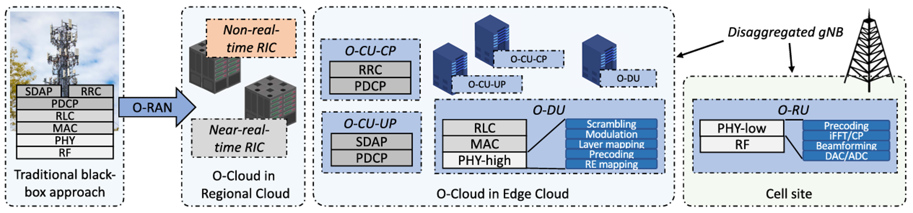
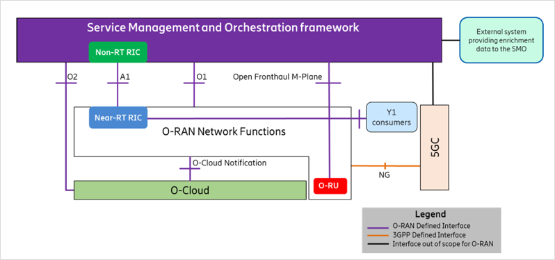
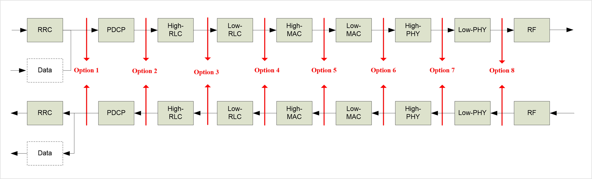
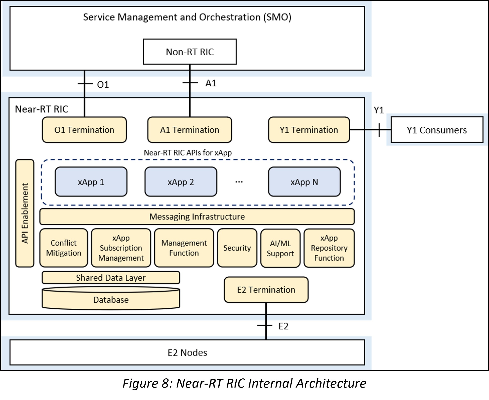
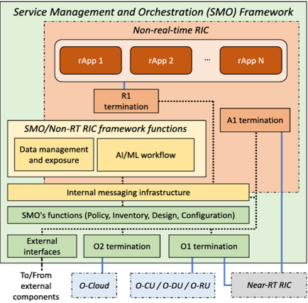
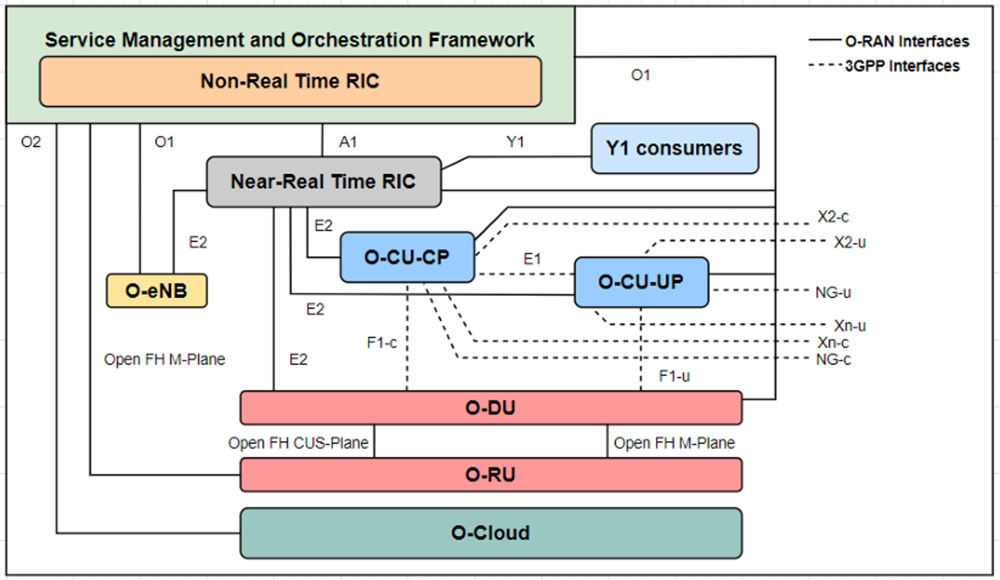
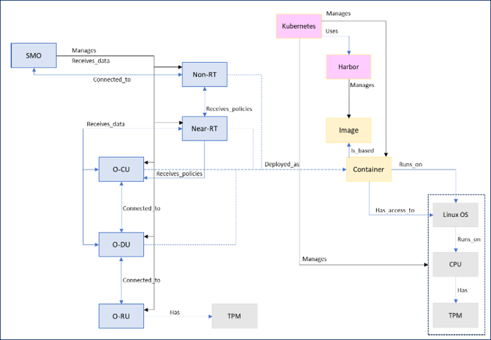
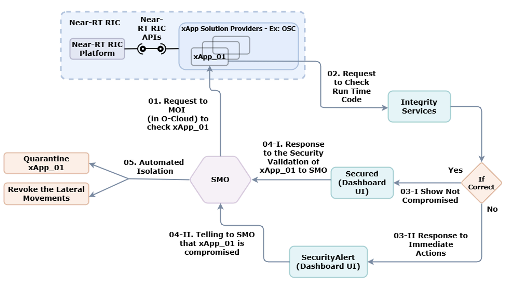
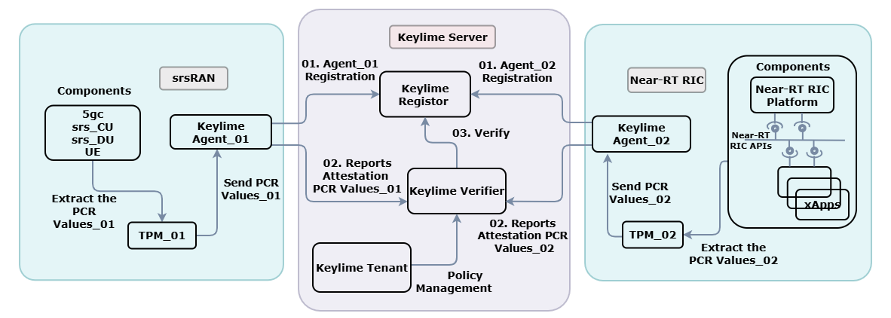
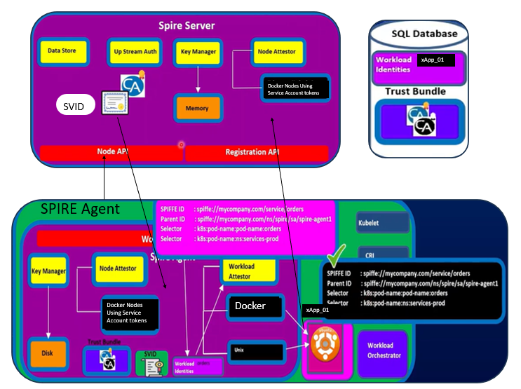

# Threat Containment Strategies for Compromised xApps in Open RAN

## Project Overview
This repository serves as the architectural foundation and research documentation for developing a **Zero‑Trust threat containment framework** within an Open RAN (O‑RAN) environment.

The primary objective of this project is to implement a security framework that enhances the resilience of the **Near‑Real‑Time RAN Intelligent Controller (Near‑RT RIC)** by actively authenticating workloads and isolating compromised third‑party microservices (xApps) at runtime.

**Team Members:**
- Dewmith M.K.J. (EG/2021/4474)
- Dilshan M.D.K. (EG/2021/4485)
- Sewinda L.L.D. (EG/2021/4807)
- Thilohith T.K. (EG/2021/4832)

**Supervisors:**
- Dr. Chatura Seneviratne
- Prof. Dr. An Braeken
- Mr. Pramitha Fernando

---

## 1. What is O‑RAN and Where is it Used?

Traditional Radio Access Networks (RAN) are fundamentally monolithic “black boxes”. In these legacy systems, all functionalities—from Radio Frequency (RF) processing up to Radio Resource Control (RRC)—are bundled into a single vendor’s proprietary hardware. This closed ecosystem limits flexibility, stifles innovation, and causes severe vendor lock‑in.

**Open RAN (O‑RAN)** shatters this paradigm by introducing three core principles:

1. **Architectural Disaggregation** – The 5G base station (gNB) is split into logical units: the Central Unit (O‑CU), Distributed Unit (O‑DU), and Radio Unit (O‑RU). This allows operators to deploy different layers of the 3GPP protocol stack across different hardware and geographic locations (e.g., edge clouds vs. cell sites).
2. **Open Interfaces** – Standardized interfaces (such as E2, A1, O1, and Open Fronthaul) connect these disaggregated components, ensuring seamless interoperability between different hardware and software vendors.
3. **Intelligent Orchestration** – O‑RAN introduces the RAN Intelligent Controllers (RICs)—specifically the Non‑Real‑Time RIC and the Near‑Real‑Time RIC. These platforms run machine learning algorithms and optimization routines to actively control the radio network.

**Where is it used?**  
O‑RAN is deployed in modern 5G Standalone (SA) networks, private enterprise 5G, and edge‑computing telecom data centers where operators require highly scalable, cloud‑native infrastructure.

  
   <em>Figure 1: Evolution of the traditional base station to a virtualized, disaggregated gNB</em>

---

## 2. O‑RAN Architecture and Key Principles

The O‑RAN architecture is built on four key principles:

| Principle | Description |
|-----------|-------------|
| **Disaggregation** | Splitting the gNB into O‑CU, O‑DU, and O‑RU, each with well‑defined functions. |
| **Virtualization** | Running network functions as software on commodity hardware (the O‑Cloud), enabling cloud‑native deployment. |
| **Intelligent control** | Introducing RICs that use AI/ML to optimize network performance via closed‑loop automation. |
| **Open interfaces** | Standardizing interfaces between components to allow multi‑vendor interoperability. |

  
   <em>Figure 2: High‑level O‑RAN architecture</em>

---

## 3. The O‑RAN Stack: CU, DU, RU and Functional Splits

The O‑RAN stack follows the 3GPP functional split, with the gNB divided into:

- **O‑CU (Central Unit)** – Hosts RRC, PDCP, and SDAP layers. It is further split into O‑CU‑CP (control plane) and O‑CU‑UP (user plane).
- **O‑DU (Distributed Unit)** – Hosts RLC, MAC, and the High‑PHY layer.
- **O‑RU (Radio Unit)** – Hosts the Low‑PHY layer and RF components.

The O‑RAN specifications define the **7.2x functional split** between the O‑DU and O‑RU, balancing fronthaul bandwidth, latency, and implementation complexity.

  
   <em>Figure 3: 3GPP protocol layers mapped to O‑RAN components</em>

---

## 4. The RAN Intelligent Controllers (RICs)

### 4.1 Near‑RT RIC and xApps
- **Operating timescale:** 10 ms – 1 s  
- **Role:** Real‑time optimization of RAN functions (handovers, scheduling, load balancing)  
- **xApps:** Microservices that run on the Near‑RT RIC and use the E2 interface to collect data and issue control actions to RAN nodes.  
- **Internal components:** Messaging infrastructure, Shared Data Layer (SDL), Network Information Base (NIB), conflict mitigation, and security sub‑system.

  
   <em>Figure 4: Near‑RT RIC internal architecture</em>

### 4.2 Non‑RT RIC and rApps
- **Operating timescale:** > 1 s  
- **Role:** Higher‑level orchestration, policy management, AI/ML model training, and lifecycle management.  
- **rApps:** Applications that run on the Non‑RT RIC and provide network‑wide optimization, such as spectrum management, service assurance, and slicing.  
- **Interfaces:** A1 (to Near‑RT RIC), O1 (to managed elements), O2 (to O‑Cloud).

  
   <em>Figure 5: Non‑RT RIC and SMO logical architecture</em>

---

## 5. Key O‑RAN Interfaces

| Interface | Connects | Purpose |
|-----------|----------|---------|
| **E2** | Near‑RT RIC ↔ O‑CU/O‑DU/eNB | Real‑time control and telemetry; supports multiple service models (KPM, NI, RC, etc.). |
| **A1** | Non‑RT RIC ↔ Near‑RT RIC | Policy guidance, enrichment information, and ML model management. |
| **O1** | SMO ↔ O‑RAN NFs | FCAPS management, configuration, performance monitoring, software upgrades. |
| **O2** | SMO ↔ O‑Cloud | Cloud infrastructure management, workload deployment, orchestration. |
| **Open Fronthaul** | O‑DU ↔ O‑RU | 7.2x split transport over Ethernet; includes C‑plane, U‑plane, S‑plane, M‑plane. |

  
   <em>Figure 6: O‑RAN interfaces</em>

---

## 6. Security Challenges in O‑RAN

The openness and disaggregation of O‑RAN introduce new security challenges:

- **Expanded attack surface** – More interfaces, more components, and third‑party xApps/rApps.
- **Trust gaps** – Multi‑vendor components must trust each other; physical location no longer implies legitimacy.
- **xApp‑specific threats** – Malicious or compromised xApps can exhaust resources, leak UE data, manipulate control loops, or disrupt the network.
- **Supply chain risks** – Vulnerable third‑party libraries, backdoors, or poisoned CI/CD pipelines.
- **AI/ML vulnerabilities** – Poisoned training data, model theft, adversarial attacks.

These challenges necessitate a **Zero Trust** approach, where every component is continuously verified before being allowed to act.

  
   <em>Figure 7: Threat landscape in O‑RAN</em>

---

## 7. Our Project: Threat Containment for Compromised xApps

### 7.1 Problem Statement
O‑RAN allows third‑party xApps to execute control actions inside the Near‑RT RIC. A compromised xApp can:
- Exhaust shared resources (CPU, memory), causing Denial of Service.
- Leak sensitive UE information (IMSI, location).
- Issue malicious control commands, disrupting RAN operations (e.g., power oscillations, incorrect handovers).
- Move laterally within the RIC platform and compromise other xApps.

Current security measures are largely static (pre‑deployment scanning, code signing) and do not handle runtime compromises. There is a critical need for **automated, runtime containment mechanisms**.

### 7.2 Objectives
- Implement a security framework that enhances the resilience of the Near‑RT RIC against compromised xApps.
- Integrate **remote attestation** (using TPM and Keylime) to verify the integrity of the host and xApp images before deployment.
- Implement **workload identity attestation** (using SPIRE/SPIFFE) to issue short‑lived, cryptographically verifiable identities to xApps.
- Develop an **automated isolation pipeline** that, upon detection of anomalies, quarantines the compromised xApp.
- Validate the framework experimentally in a realistic O‑RAN testbed.

### 7.3 Proposed Security Framework Overview
Our framework combines three complementary layers:

1. **Hardware‑rooted remote attestation** – ensures the underlying host and container images are untampered.
2. **Workload identity attestation** – verifies that each xApp is the intended, signed workload and issues a unique identity token (SVID).
3. **Runtime monitoring & automated isolation** – continuously observes xApp behaviour; on anomaly detection, the xApp is automatically isolated.

  
   <em>Figure 8: Proposed security workflow – from deployment to runtime containment</em>

### 7.4 Remote Attestation with Keylime (TPM‑based)
**Keylime** is an open‑source remote attestation framework that uses a TPM as the Root of Trust. In our setup:
- The **attestation agent** runs on each O‑Cloud host.
- The **verifier** (co‑located with the SMO) periodically challenges the host to provide signed measurements (PCR values, file hashes).
- Before an xApp is deployed, the verifier checks that the host is in a known‑good state and that the container image hashes match a reference.
- If attestation fails, the xApp is blocked from starting.

  
   <em>Figure 9: Remote attestation workflow</em>

### 7.5 Workload Identity Attestation with SPIRE/SPIFFE
**SPIRE (SPIFFE Runtime Environment)** automates workload attestation and identity issuance. The process:
- **Node attestation** – verifies the host using TPM (or cloud provider metadata).
- **Workload attestation** – inspects the container (cgroups, namespace, image digest) to confirm it is the expected workload.
- Upon success, SPIRE issues an **SVID (SPIFFE Verifiable Identity Document)** – a short‑lived X.509 certificate.
- The xApp uses this SVID to authenticate to the RIC platform (e.g., E2 interface, SDL) using mTLS.
- Access policies are based on the SPIFFE ID (e.g., `spiffe://oran.org/xapp/load-balancer`), ensuring least privilege.

  
   <em>Figure 10: SPIRE attestation and SVID issuance</em>

### 7.6 CU/DU Split Testbed Setup
We have deployed a disaggregated gNB following the 3GPP CU/DU split with O‑RAN 7.2x fronthaul. The testbed consists of:

| Component | Software | Location |
|-----------|----------|----------|
| **O‑CU** | srsRAN (O‑CU) | Virtual machine (10.53.1.2) |
| **O‑DU** | srsRAN (O‑DU) | Virtual machine (10.53.1.1) |
| **O‑RU** | srsRAN (O‑RU) + ZMQ | Same VM as DU (emulated) |
| **5G Core** | Open5GS | Docker containers (10.53.1.2) |
| **Near‑RT RIC** | OSC RIC / FlexRIC | Kubernetes cluster |
| **Monitoring** | Falco, cAdvisor, Prometheus | Kubernetes |

The O‑DU and O‑RU communicate via the **Open Fronthaul** interface over ZMQ. The O‑CU connects to the 5G Core via **N2 (NGAP)** and **N3 (GTP‑U)** interfaces. The Near‑RT RIC communicates with the O‑CU/O‑DU over the **E2** interface.

### 7.7 Isolation Pipeline
When a security violation is detected (e.g., CPU usage exceeds quota, unexpected file access, or failed identity attestation), the framework triggers automated containment:

1. **Alert** – Falco or cAdvisor sends a webhook to the orchestrator (e.g., Kubernetes admission controller).
2. **Quarantine** – The xApp’s Kubernetes pod is labelled `quarantine=true`; network policies block all egress/ingress except to a logging sidecar.
3. **Snapshot** – Memory and logs are captured for forensic analysis.
4. **Terminate** – After analysis (or if the violation is severe), the pod is deleted and the xApp is removed from the SDL.

This pipeline ensures that even if an xApp is compromised at runtime, the damage is contained within seconds.

### 7.8 Future Work
- **Integration of Zero‑Knowledge Virtual Machines (zkVMs)** – to provide cryptographic proof of correct computation without revealing internal data.
- **Machine learning‑based anomaly detection** – using network telemetry to detect subtle behavioural deviations.
- **Cross‑RIC coordination** – enabling the Non‑RT RIC to update isolation policies based on global threat intelligence.
- **Performance benchmarking** – measuring the latency overhead introduced by attestation and isolation loops to ensure 5G timing requirements are met.

---

## 8. References
1. M. Polese, L. Bonati, S. D'Oro, S. Basagni, and T. Melodia, “Understanding O-RAN: Architecture, Interfaces, Algorithms, Security, and Research Challenges,” *IEEE Communications Surveys & Tutorials*, vol. 25, no. 2, pp. 1376–1411, 2023.
2. O-RAN Working Group 1, “O-RAN Architecture Description,” O-RAN ALLIANCE, Tech. Rep. TR.0-R004-v15.00, Oct. 2025.
3. O-RAN Working Group 3, “Near-RT RIC Architecture,” O-RAN ALLIANCE, Tech. Rep. TR.0-R004-v07.00, Feb. 2025.
4. O-RAN Working Group 11, “Study on Security for Near Real Time RIC and xApps,” Tech. Rep. TR.0-R004-v06.00.
5. srsRAN Project Documentation: https://docs.srsran.com/
6. Open5GS: https://open5gs.org/
7. Keylime Project: https://keylime.dev/
8. SPIFFE/SPIRE: https://spiffe.io/

---

## 📄 License
This work is part of an academic Final Year Project. All rights reserved.
